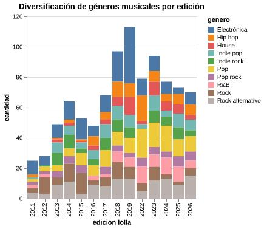

# Crónica

Desde 2011, el festival Lollapalooza llegó a Chile para quedarse. Este es un festival  que se caracteriza por traer una gran diversidad de géneros musicales para poder satisfacer todos los gustos de la audiencia y generar adhesión con el público. El rock dominaba casi en su totalidad los lineups de los primeros años, caracterizado por su predominante banda sonora con guitarras eléctricas, bajos, baterías, el volumen alto, las temáticas de rebeldía, libertad e incluso la crítica social. Quince ediciones después, ese paisaje musical es completamente distinto.

Luego de un exhaustivo análisis de los géneros musicales de todos los artistas que han pasado por el festival (2011 a 2026), los datos revelan una transformación gradual pero sostenida. Es a partir de 2016 cuando la cartelera comenzó a incorporar otros estilos: música electrónica, hip hop, pop, indie pop, urbano, reguetón, entre otros que fueron ganando espacio edición tras edición, reduciendo el peso predominante del rock dentro del festival.

Precisamente ese cambio en la variación de los géneros musicales es lo que quiere demostrar de manera simplificada este gráfico de barras que cree con Altair. Puesto que la diversidad es demasiado grande —ya que en la base de datos se consideró incluir tres géneros musicales por cada cantante y banda—, el gráfico que acompaña esta crónica muestra la distribución de los diez géneros musicales más frecuentes en cada edición del festival entre los años 2011 y 2026. Cada barra representa una edición y a la vez esta se divide por colores que representan un género distinto dentro de ese cartel. Al recorrerlo, se puede observar como los colores que representan el rock y el rock alternativo van cediendo espacio a otros colores con el paso de los años. Es en 2018 y 2019 por ejemplo donde la música electrónica se hizo notar, así también el pop en 2022 hasta la actualidad.

Este fenómeno refleja una transformación social y cultural. Lo anterior se explica porque el mercado de Lollapalooza funciona en base a las tendencias musicales presentes en la sociedad, lo que quiere decir que la aparición de nuevos géneros responde a gustos y preferencias cada vez más diversos que varían por cada persona en particular. Así, lo que comenzó con un festival predominantemente con una identidad rockera, se convirtió en un espacio donde conviven decenas de géneros y estilos, adaptándose a los cambios de consumo musical. 

