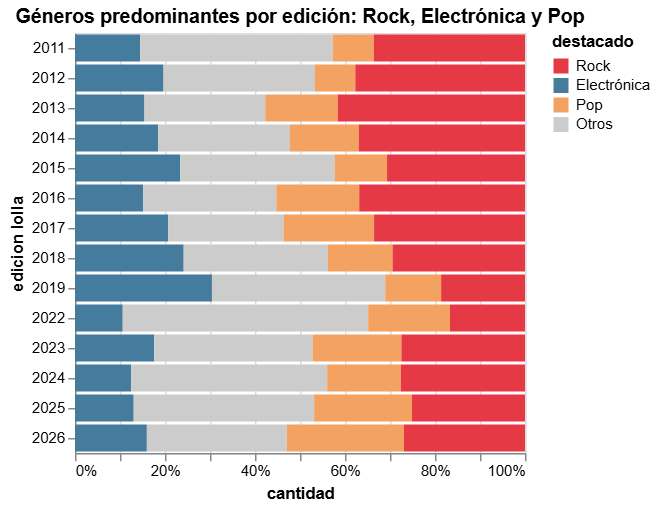

# Análisis de las visualizaciones #

## ¿Cuánto han variado los géneros? 

En este gráfico de barras hemos podido desglosar de forma más simple y comprensible la variedad de géneros que han predominado en cada edición de Lollapalooza Chile, destacando principalmente la electrónica, el pop y el rock, considerando también los subgéneros de cada uno. 

Esta visualización busca demostrar que, si bien Lollapalooza inició como un festival dedicado principalmente al rock, con los años, otros géneros musicales fueron tomando fuerza, revelando variaciones como por ejemplo una "caída" del rock en la edición 2022. 

Sin embargo, la conclusión más importante que nos refleja el gráfico es que ningún género ha llegado a desaparecer del todo, sino que el abanico de artistas y sus respectivos géneros están en constante variación con el paso de los años. 

