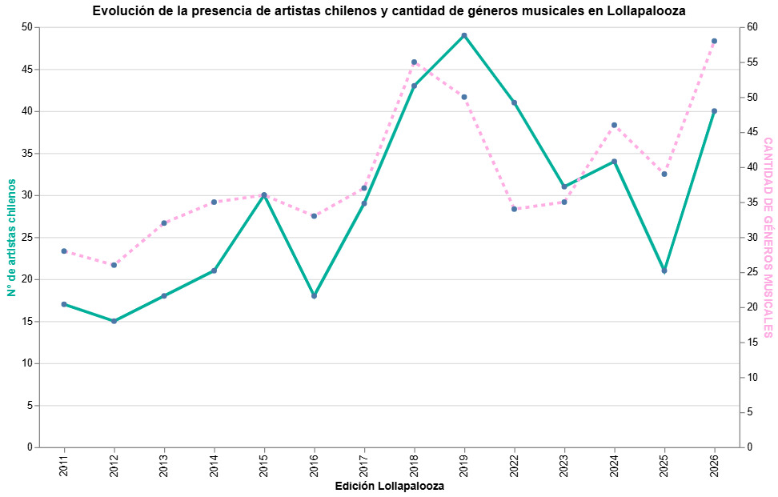

# Análisis de las visualizaciones #

## ¿Cuánto han variado los géneros? 

En este gráfico de barras hemos podido desglosar de forma más simple y comprensible la variedad de géneros que han predominado en cada edición de Lollapalooza Chile, destacando principalmente la electrónica, el pop y el rock, considerando también los subgéneros de cada uno. 

Esta visualización busca demostrar que, si bien Lollapalooza inició como un festival dedicado principalmente al rock, con los años, otros géneros musicales fueron tomando fuerza, revelando variaciones como por ejemplo una "caída" del rock en la edición 2022. 

Sin embargo, la conclusión más importante que nos refleja el gráfico es que ningún género ha llegado a desaparecer del todo, sino que el abanico de artistas y sus respectivos géneros están en constante variación con el paso de los años. 

## ¿Cuál es la representación de artistas chilenos en Lollapalooza y sus respectivos géneros?

En el siguiente gráfico analizamos la evolución de la presencia de los artistas nacionales en el festival. A partir de él, se observa que en las primeras ediciones del Lollapalooza Chile había una presencia muy baja de artistas nacionales, manteniéndose en un promedio de 20 presentaciones por año.

No es hasta 2017 que comienza a haber un crecimiento sostenido de la presencia chilena en este festival, superando anualmente el promedio mencionado anteriormente. En las ediciones de 2018, 2019 y 2022 predomino la presencia de estos artistas nacionales, alcanzando su punto más alto con un total de 49 artistas chilenos en la parrilla para 2019.

Además, realizamos un análisis sobre la variación en la cantidad de géneros musicales de los artistas chilenos, lo anterior con la intención de observar si la evolución de la presencia de estos artistas va de la mano con un aumento en la diversidad de géneros musicales
