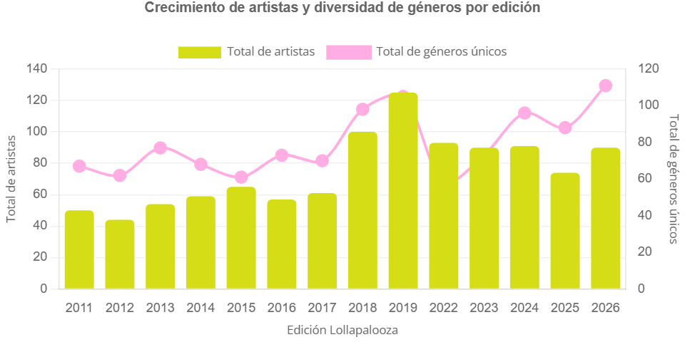
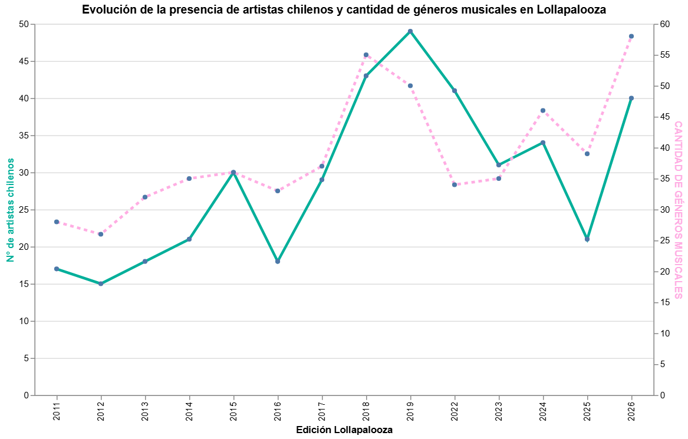
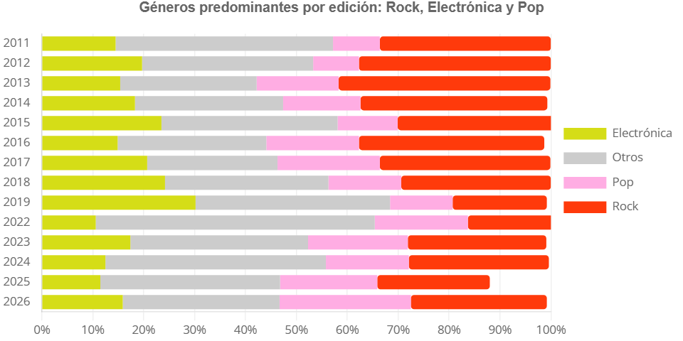

# Diseño de la historia y narrativa

## Diseño de la información y recorrido del usuario 

La primera decisión que tomamos fue comenzar con un contexto previo sobre el hecho en sí a analizar, que en nuestro caso era la llegada de Lollapalooza a Chile y la propuesta inicial de este festival. 

A medida en que fuimos avanzando, nuestra idea general era demostrar que Lollapalooza se ha ido transformando a lo largo de los años (lo que va de la mano con nuestra hipótesis), por lo que decidimos guiar la narrativa hacia lo que consideramos uno de los principales ejes del cambio: los géneros musicales. 

La sección que sigue a la introducción fue desarrollada en base a esto: contar qué géneros o artistas habían sido predominantes en un inicio y cómo las nuevas modas, estilos y “lo popular” dio paso a que el festival se abriera a incluir artistas de diversos géneros musicales, desglosando en los gráficos desarrollados y en la sección de “botones” de cada edición, en donde al usuario le es posible explorar de una forma más interactiva los géneros musicales por año. 

 Consideramos que este cambio en los estilos musicales que fueron incluidos a Lollapalooza es lo que desató el cambio o “la evolución performática”, que desarrollamos en la siguiente sección. 

Es aquí donde abordamos cómo ha cambiado el concepto de concierto en vivo, pues incluimos las variables como el vestuario, la escenografía, las visuales y los bailes o coreografías que desarrollan los artistas o bandas al momento de presentarse en el escenario y su desenvolvimiento como tal, el cual en ocasiones, va mucho más allá de solo “música en vivo”. Estas variables fueron analizadas en la construcción de la línea de tiempo, que considera porcentajes para que el usuario pueda ver en cifras que el cambio ha sido real y notorio año tras año, pero que eso no significa necesariamente que las cifras sean crecientes en todas las ediciones. 

## Sobre el estilo narrativo y las visualizaciones 

En cuanto a las crónicas, nos basamos en trabajos anteriores en donde analizamos la diversidad de géneros musicales presentes en el festival, así como la presencia de los artistas nacionales a lo largo de las ediciones junto con la variedad de géneros que estos ofrecían. 

La diversidad de géneros se ha hecho evidente con el pasar de los años. Como bien se ha comentado a lo largo de las entregas, los datos demuestran que los géneros musicales han ido diversificándose, trayendo a la cartelera una variedad musical ligada a los gustos de la audiencia y de la oferta y demanda. En sus inicios, este festival se caracterizaba por su fuerte presencia rockera; hoy, esa identidad se ha amortiguado por la fuerza y el surgimiento de nuevos géneros. Por lo mismo, ello debía quedar expresado en la narrativa de nuestra webstory, y los gráficos y fotos dispuestos son el fiel reflejo de ello.

Sumado a esto, en nuestra webstory decidimos evidenciar cómo la presencia de artistas nacionales en este festival ha aumentado con el paso de los años, además de mostrar la variedad de géneros musicales que estos ofrecían en cada edición. Dado que el foco central de nuestro reportaje es la evolución performática de las presentaciones del Lollapalooza, decidimos puntualizar los datos más interesantes de este ámbito del festival. Esto se hizo tanto para no alejarnos de nuestro foco principal como para no dejar de lado el cómo la música chilena forma parte importante de este evento.

En cuanto al texto que utilizamos en la página web, lo que más destacamos es el uso de las preguntas en la mayoría de los subtítulos. Al utilizar este recurso, buscamos potenciar el interés del usuario para que continúe leyendo nuestra webstory, ya que no querrá quedarse con la incertidumbre respecto de cuáles son las respuestas a esas preguntas.

En nuestras secciones, y como se mencionó previamente, buscamos introducir al usuario en nuestra historia, brindándole un contexto sobre la llegada del festival al país, explicando cómo ha evolucionado la oferta musical que ofrece este evento, para luego darle a conocer la evolución performática de los artistas que se han presentado en el festival. En todas estas secciones utilizamos un estilo narrativo informativo, por ende, predomina la objetividad en la redacción de nuestro texto, ofreciendo datos duros y análisis en base a estos últimos. 

Al usar este estilo narrativo, la historia de nuestras visualizaciones se refuerza, esto ya que el usuario comprenderá que los gráficos interactivos realizados nacen a partir de información verídica. Esto permite que las visualizaciones no sean observadas únicamente como decoración para la página web, sino que como un complemento para recibir información de forma más breve estimulante y atractiva visualmente.

Al ofrecer una redacción objetiva y documentada, apoyada en visualizaciones, se busca reforzar la confianza que la audiencia deposite en el contenido que están consumiendo.

## Decisiones sobre elementos visuales 

La página web consta con una serie de elementos visuales acordes con la estética representativa del festival Lollapalooza para generar cercanía y darle una identidad a la página “LollaPerformances”.

De partida, a su lado derecho, la página web contempla un menú que permite viajar de manera más rápida a las secciones del reportaje. A su costado izquierdo, podemos percibir el logo “LollaPerformances” con la tipografía del festival. A su vez, se puede apreciar en la barra del buscador el ícono "LP", el cual representa la abreviación de LollaPerformances y que a su vez presenta los colores

La paleta de colores utilizada fue inspirada en la página web de Lollapalooza, los lineups y sus publicaciones en redes sociales, de forma que sea atractiva visualmente para el usuario. Por su parte, la tipografía utilizada en la página web fue Open Sans, una de las fuentes propuestas en el manual de identidad de la Entrega 04, sin embargo, las otras fuentes como Titan One y Fredoka One no las pudo leer el programa. No obstante, para la visualización de la línea de tiempo de los show performáticos, se pudo utilizar las fuentes Fredoka y Formula.

En cuanto a nuestros recursos gráficos, decidimos que estos debían tener un estilo simple para que el usuario pueda comprenderlos fácilmente y no hacerlos muy llamativos ya que la diversa paleta de colores utilizados podría generar una saturación visual para quienes ingresen a la webstory. Estas gráficas acompañan y refuerzan la narrativa que se quiere contar, utilizando gráficos, carruseles de fotos e incluso de videos. De igual forma, las imágenes dispuestas le dan un atractivo visual y son reflejo de las vibras que transmite el festival y nuestra página.
